```{r setup, include=FALSE}
knitr::opts_chunk$set(echo = TRUE)
```

## Recurrent Neural Network (RNN) basic knowledge

The basic network looks like this:
```{r}
# This plot can not be shown in the html, if you want to see, uncomment it and run in Rstudio:
#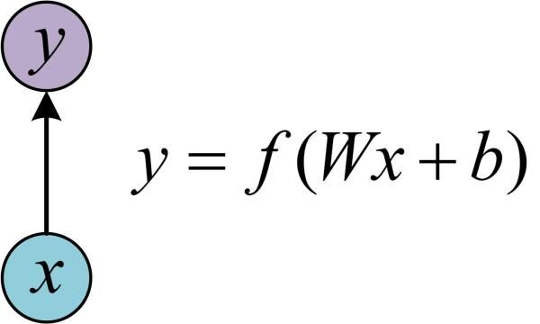
```

Input x, with adding weights W and bias b, and going through the activation function f, output y=f(Wx+b).

During our applictaion of machine learning, we will meet many situations where sequential data are given, for example:
1. Time series data: the stock price every day, or the number of tourists in a place every day;
2. Speech processing: the sound signal of every frame in an audio record.
In these situations, we will use Recurrent Neural Network (RNN) to deal with those problems.

RNN has added the theory of "hidden state", which can extract the features of sequential data and then transfer to output. Here is an example of calculating hidden state h:
```{r}
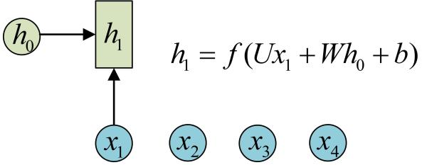
```

It will be similar to calculate the other hidden states h2, h3 and h4, with the same parameters U, W and b:
```{r}
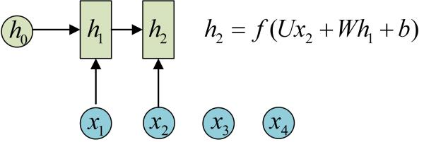
```
```{r}
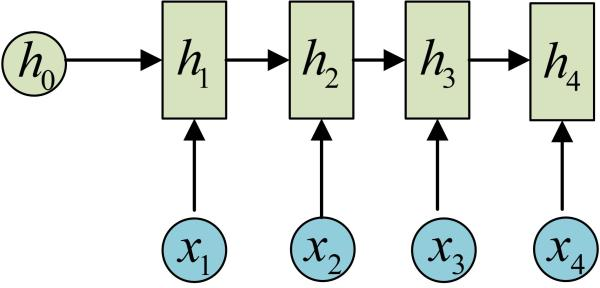
```

And then calculate the output y with hidden state h:
```{r}
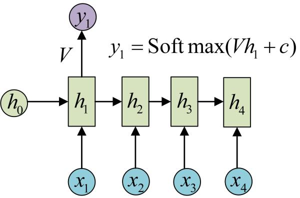
```

With the same paramters V and c, we can calculate all the y outputs:
```{r}
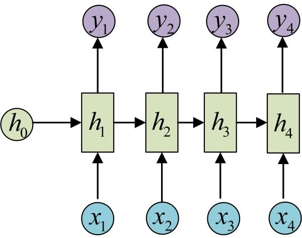
```

Suppose when our human brains are thinking, of course we will not conduct the thinking process with a totally empty brain at anytime, we will always think based on our memory of conclusion for our previous thinking. Traditional normal neural networks can not simulate this process, but RNN can achieve that with special characteristics:
```{r}
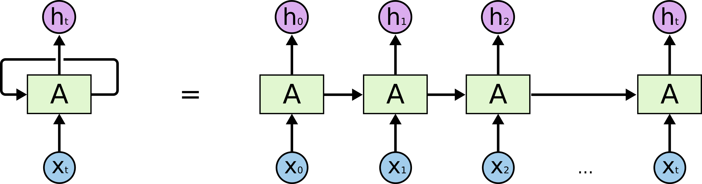
```

For each RNN module A, it takes X_t as input and output h_t. This action will keep looping and bring the information to the next RNN module. So it will not forget the information from previous step and can therefore simulate the human brain neural network. That also shows why from the previous picture when calculating h_t, it will use the last h value of h_(t-1). (Show the previous picture again:)
```{r}

```


## RNN disadvantage: The problem of Long-term Dependencies

Consider a sentence like this: "The fish is in the river."
RNN models can easily predict the last word "river" based on the memory of the previous related word "fish". When the related word and the target word needed to be predicted are near to each other, it is easy for RNN models to predict the target word.

But when a sentence is more complex like this: "I come from Portugal. It is a beautiful country. I am going to finish my university study and start my full-time work... I can speak fluent Portuguese."
If we want to predict the last word "Portuguese", the current information shows that it is a language name. But to find out what language it is, we need the information of the context around the word "Portugal" which are very far away. Unfortunately, in real-world application, it is hard for RNN to learn such far away information and the prediction will be bad. RNN will be influenced by the short-term memory and has the problem of long-term dependencies. When the distance between the related information and the predicted target is very big, it is hard for RNN to pass the previous related information to the afterwards steps.

The theory behind this RNN problem is that during the back-propagation, when we want to use gradient-descent to update the weights, basically the the update process follows this formula with η as the stepsize(learning rate):
$$
\begin{equation}
\begin{aligned}
w_1 &\leftarrow w_1 -\eta\frac{\partial L}{\partial w_1}(\boldsymbol{w})\\
w_2 &\leftarrow w_2 -\eta\frac{\partial L}{\partial w_2}(\boldsymbol{w})\\
\end{aligned}
\end{equation}
$$
With time going on, the gradients' values will be less and less, and when the gradients' values become extremely small and the updates of the weights stop, RNN will not learn anymore. For the previous layers which has little gradient and weight update, they will stop learning and so RNN will forget the previous information in a long-term sequence. That's why RNN only has short-term memory.

## Long short-term memory (LSTM)

Fortunately, there is a variant of RNN, Long short-term memory (LSTM), which can help to solve this problem.

Here is an example of how your brain works:
Suppose you want to buy something online, you will always check other buyers' comments about that product, for example a comment is like: "Good! I really like this pair of shoes. It took me such a long time to find them online. These shoes very comfortable and I wear them everyday I go to work. I will absolutely come back to this online shop in the future.

When your brain reads this comment, it will only memorize the important information and forget those unrelated words. Our brain will memorize the words like "Good", "comfortable", "absolutely come back", and forget the not important words like "I", "long time", "them". This is how LSTM basically works, LSTM will memorize the important and related information, and forget the not important information, to learn long-term dependency information.

The basic structure of LSTM:
```{r}
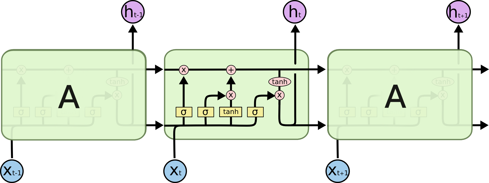
```
The activation function tanh(the hyperbolic tangent) is used to adjust the value going through the network to be between -1 and 1. The activation function sigmoid is used to adjust the value to be between 0 and 1, when any value multiply with 0, the result is 0 so this information will be forgotten; when any value multiply with 1, the result is the value itself so this information will be kept.

The "memory" of LSTM can be called as memory cells, it takes as inputs the previous state h_(t-1) and current x value x_t. These memory cells will decide which information will be kept or forgotten. This way can effectively keep the related information from a long time ago. Actually the key point of LSTM is the cell state (C_t):
```{r}
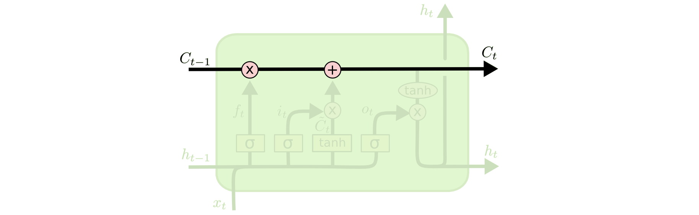
```
(To understand the plot: Circle node means pointwise operation, e.g."x" means multiply; "+" means plus.
                         Rectangle node means neural network layer.
                         Arrow means vector transfer.
                         Arrows converging means concatenate.
                         Arrow diverging means copy.)
LSTM has three different gate structures: forget gate, input gate and output gate, to control whether the information can pass or not.

# Forget gate

The first step in LSTM is to decide which information in the cell state to forget, which is conducted using "Forget gate". It inputs the previous output h_(t-1) and the current x value x_t, and pass a sigmoid function where output a vector. The values of all the dimensions of the vector is between 0 and 1(0 means totally forget, 1 means totally keep, which can be treated as forgetting not important information and memorizing important information). At last it times the cell state C_(t-1).

If we want an analogy of this theory. Basically in a sentence if the cell state knows the gender of the subject, the correct personal pronoun will be chosen. When later we see a new subject, we will need to forget the information of the previous subject.
```{r}
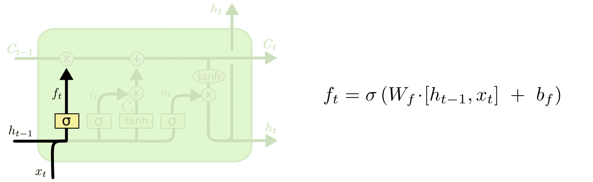
```
If we write the formula as matrix expression (W value is weights and b value is bias):
$$
\begin{align}
\boldsymbol{F}_{t}&=\sigma(\boldsymbol{X}_{t}\boldsymbol{W}_{xf}+\boldsymbol{H}_{t-1}\boldsymbol{W}_{hf}+\boldsymbol{b}_{f})\\
Dimensions:\\
\boldsymbol{X}_{t(n\times d)}\\
\boldsymbol{W}_{xf(d\times h)}\\
\boldsymbol{H}_{t-1(n\times h)}\\
\boldsymbol{W}_{hf(h\times h)}\\
\boldsymbol{b}_{f(n\times h)}\\
\end{align}
$$
Here is a gif for clearer visualization:
```{r}
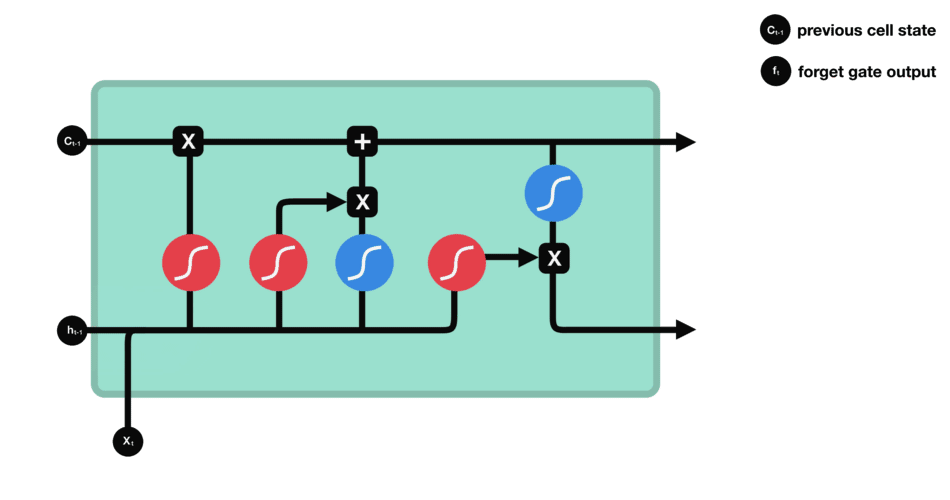
```

# Input gate

The next step is to decide which new information to be kept in the cell state, which contains two parts:
Part 1. Use the sigmoid layer to decide which value to be updated.
Part 2. Use the tanh layer to create a candidate memory cell to be added to the cell state.

In an analogy, it can be treated in a sentence as adding the information of the gender for a new subject in the cell state, to replace the old and forgotten subject.
```{r}
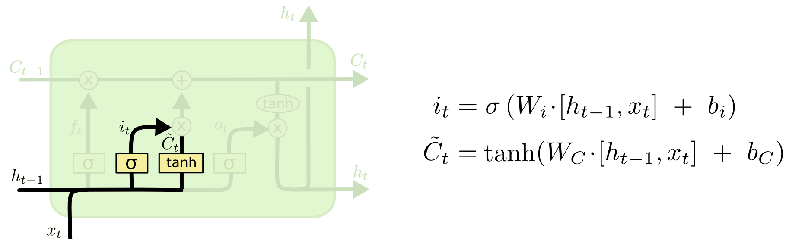
```
If we write the formula as matrix expression (W value is weights and b value is bias):
$$
\begin{align}
\boldsymbol{I}_{t}&=\sigma(\boldsymbol{X}_{t}\boldsymbol{W}_{xi}+\boldsymbol{H}_{t-1}\boldsymbol{W}_{hi}+\boldsymbol{b}_{i})\\
\boldsymbol{\tilde{C}}_{t}&=\tanh(\boldsymbol{X}_{t}\boldsymbol{W}_{xc}+\boldsymbol{H}_{t-1}\boldsymbol{W}_{hc}+\boldsymbol{b}_{c})\\
Dimensions:\\
\boldsymbol{X}_{t(n\times d)}\\
\boldsymbol{W}_{xi(d\times h)}; \boldsymbol{W}_{xc(d\times h)}\\
\boldsymbol{H}_{t-1(n\times h)}\\
\boldsymbol{W}_{hi(h\times h)}; \boldsymbol{W}_{hc(h\times h)}\\
\boldsymbol{b}_{i(n\times h)}; \boldsymbol{b}_{c(n\times h)}\\
\end{align}
$$
Here is a gif for clearer visualization:
```{r}
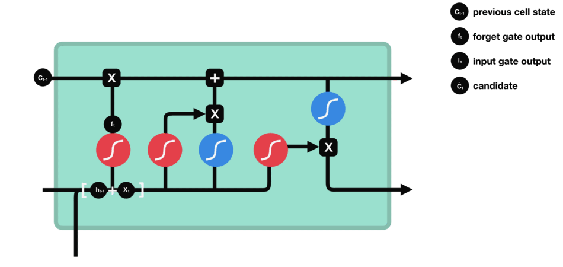
```

# Cell state

Now it is time to update the cell state from C_(t-1) to C_t. The previous steps have decided the objectives of what to do, now is the time to achieve them.
We multiply the previous cell state C_(t-1) with f_t, which is removing the information to be forgotten. The add it with i_t times C_t_tilde. The result is the new memory cell state C_t.
```{r}
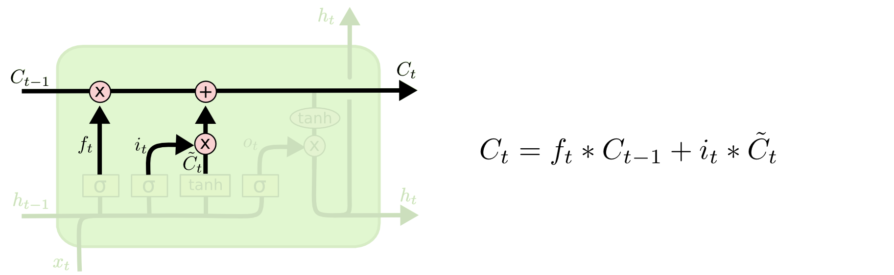
```
If we write the formula as matrix expression:
$$
\begin{align}
\boldsymbol{C}_{t}&=\boldsymbol{F}_{t}\odot\boldsymbol{C}_{t-1}+\boldsymbol{I}_{t}\odot\boldsymbol{\tilde{C}}_{t}\\
Dimensions:\\
\boldsymbol{F}_{t(n\times h)}\\
\boldsymbol{C}_{t-1(n\times h)}; \boldsymbol{\tilde{C}}_{t(n\times h)}\\
\boldsymbol{I}_{t(n\times h)}\\
\end{align}
$$
PAY ATTENTION: Here the two multiplications are Hadamard product, which is the multiplication of the elements in the same position of matrices. It conducts the multiplication of matrices in the same dimension.
Hadamard product exmaple:
```{r}
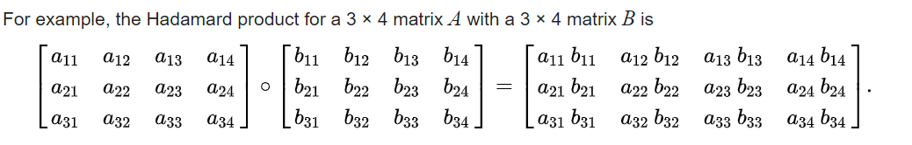
```

Here is a gif for clearer visualization:
```{r}
knitr::include_graphics("plots and gif used/cell state update gif.gif")
```

# Output gate

At last, we need to confirm which value to output.
We need to first run a sigmoid layer to decide which part of the cell state C_t to output. Then, we need to use tanh to process the cell state C_t and multiply with the result from sigmoid layer. At last, we output it as h_t.

In the analogy of a sentence, when we see a personal pronoun, we may need to output the information related to a verb. For example, we need to output the information whether the personal pronoun is in singular form or plural form, so that if the next word is a verb, we will know the proper changes of the verb, for example if the pronoun is a third-person singular pronoun, then we need to add an "s" after the verb.
```{r}
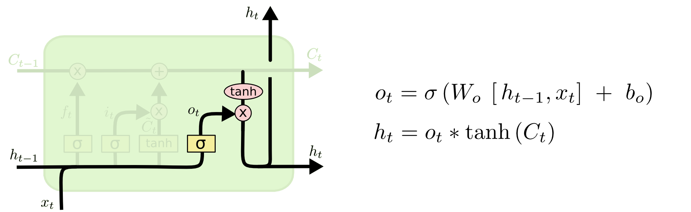
```
If we write the formula as matrix expression (W value is weights and b value is bias) (markdown):
$$
\begin{align}
\boldsymbol{O}_{t}&=\sigma(\boldsymbol{X}_{t}\boldsymbol{W}_{xo}+\boldsymbol{H}_{t-1}\boldsymbol{W}_{ho}+\boldsymbol{b}_{o})\\
\boldsymbol{H}_{t}&=\boldsymbol{O}_{t}\odot\tanh(\boldsymbol{C}_{t})\\
Dimensions:\\
\boldsymbol{X}_{t(n\times d)}\\
\boldsymbol{W}_{xo(d\times h)}; \boldsymbol{W}_{ho(h\times h)}\\
\boldsymbol{H}_{t-1(n\times h)}\\
\boldsymbol{b}_{o(n\times h)}\\
\end{align}
$$
PAY ATTENTION: Here the multiplication of O_t and tanh(C_t) is Hadamard product, which is the multiplication of the elements in the same position of matrices. It conducts the multiplication of matrices in the same dimension.

Here is a gif for clearer visualization:
```{r}
knitr::include_graphics("plots and gif used/output gate gif.gif")
```


