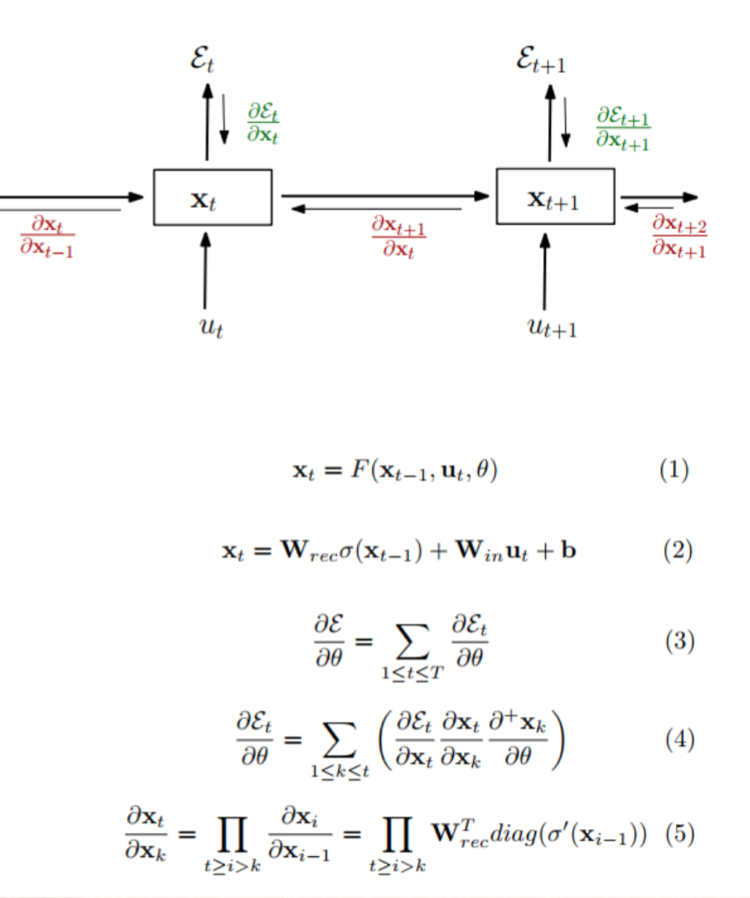

```{r setup, include=FALSE}
knitr::opts_chunk$set(echo = TRUE)
```

# Motivation

If you are interested in deep learning and natural language processing, then learning about Long Short-Term Memory (LSTM) networks is an absolute must. LSTMs are a powerful type of Recurrent Neural Network (RNN) that are capable of learning and remembering long-term dependencies in sequential data, making them ideal for tasks such as language modeling, speech recognition, and machine translation.

In this tutorial, you will learn the fundamentals of LSTMs and how they can be used to solve real-world problems in time series prediction. You can expect to have a glance on how to build an LSTM network from scratch using R and the popular deep learning library, Keras. 

By the end of this tutorial, you will have a solid understanding of LSTMs and their applications in processing sequential data. Whether you are a beginner or an experienced deep learning practitioner, this tutorial aims to provide you with the knowledge and skills you need to start building your own LSTM-based models and solving real-life problems. So, if you are ready to take your deep learning skills to the next level, then let's get started!

# Basic Knowledge of Recurrent Neural Network (RNN)

## Theory
Let us first have an overlook at the structure of RNN.

```{r}
knitr::include_graphics("plots and gif used/structure.png")
```


Despite weights W, bias b, and the activation function f, RNN contains "hidden states", which are aiming to extract features of previous data points and then transfer the memory to the subsequent learning process. The following graphic demonstrates how to pass down the first hidden state, $h_0$ to the following calculations.

```{r}

```

Similarly, hidden states h2, h3 and h4 can be found using the same parameters U, W and b:
```{r}
knitr::include_graphics("plots and gif used/hidden state 2.png")
```
```{r}
knitr::include_graphics("plots and gif used/hidden states.png")
```

Finally, we use softmax to calculate the output y with hidden state h:
```{r}

```

With the same parameters V and c, we are able to obtain all the y outputs in sequence:
```{r}

```

When humans engage in thinking, our brains are never completely empty. Rather, we build on past conclusions and memories to guide our current thoughts. Unlike traditional neural networks, Recurrent Neural Networks (RNNs) possess the ability to simulate this process through using the hidden states. For each RNN cell, it takes $X_t$ as an input and outputs both $y_t$ and $h_t$. This action repeats and delivers memorized information to affect the subsequent outputs. 

```{r}

```

## Drawbacks of RNN

**Deficiency at Retaining Information over Long Periods of Time**  

Consider a sentence: "The fish is in the river." RNN models can easily predict the last word "river" based on the memory of the previous related word "fish". When the related word and the target word needed to be predicted are near to each other, it is easy for RNN models to predict the target word.  

However, when it comes to a sentence that is more complex: "I come from Portugal. It is a beautiful country. I am going to finish my university study and start my full-time work... I can speak fluent Portuguese." If we would like to predict the last word "Portuguese", the recent information indicates it is a language name. 
Nevertheless, to find what language it refers to, we need the context "I come from Portugal", which is far from the current position.  

RNNs are inherently deficient at retaining information over long periods of time.  

The concept is illustrated in the image below, where the amount of color present in each step of the sequence reveals the pieces of information that persist over time. As we can tell, in the last step, it only memories little of the earliest information.  

```{r}

```


**Vanishing/Exploding Gradient Problem**

In addition, RNN suffers from the vanishing/exploding gradient problem, making training process unstable. 

While we want to use the gradient-descent method to update the weights, the update process follows the formula with η as the stepsize(learning rate):
$$
\begin{equation}
\begin{aligned}
w_1 &\leftarrow w_1 -\eta\frac{\partial L}{\partial w_1}(\boldsymbol{w})\\
w_2 &\leftarrow w_2 -\eta\frac{\partial L}{\partial w_2}(\boldsymbol{w})\\
\end{aligned}
\end{equation}
$$

These gradient problems can happen because the gradients are multiplied by the weights of the network multiple times during back-propagation. 

```{r}

```

The vanishing problem arises when gradients become small, while the exploding problem occurs when gradients are too large. 

## An Variant of RNN

How to solve these issues mentioned above? Here we have LSTM.

# Foundamentals of Long Short-Term Memory (LSTM)

LSTM is a more complex variant of RNN that includes additional memory cells and gating mechanisms.  

Thinking about how your brain works: Suppose you want to buy something online, you will always check other buyers' comments about that product. Let's say there is a comment: "Good! I really like this pair of shoes. It took me such a long time to find them online. These shoes are very comfortable and I wear them everyday I go to work. I will absolutely come back to this online shop in the future."  

Reading this comment, your brain would only memorize the important information and forget those unrelated. For instance, it may memorize the words "good", "comfortable", and forget those irrelevant phrases such as "long time", "go to work".  Intuitionally, this is how LSTM works. LSTMs attempt to memorize only the critical information, and ignore those unrelated patterns.  
 
Here is the basic structure of LSTM:
```{r}

```
  
To understand the graphic above:  

* Circle node means pointwise operation, e.g. "x" means multiply; "+" means plus.  
  
* Rectangle node means neural network layer.    
  
* Arrow means vector transfer.  
  
*  Arrows converging means concatenate.  

*  Arrow diverging means copy.  

  
  
  
There are 2 kinds of activation functions:  

* The activation function tanh(the hyperbolic tangent) is used to adjust the value going through the network to [-1,1].  

* The activation function sigmoid is used to adjust the value to [0,1], where 0 represents the message to be totally ignored while 1 stands for the action to keep the complete message.  
   
   
  
     
Each memory cell in LSTM takes 3 inputs:  

* the previous hidden state $h_{t-1}$  

* current x value $x_t$  

* the cell state $C_t$
  
  
  
  
Besides, it has 3 different gating mechanisms to control whether the information can be passed downwards or not:  

* forget gate  

* input gate  

* output gate  


## Forget Gate: to forget useless information

The first step in LSTM is to decide which information in the cell state to forget, which is conducted by "Forget gate". It inputs the previous output $h_(t-1)$ and the current x value $x_t$, and passes them through a sigmoid function and outputs a vector. The values of all the dimensions of the vector is between 0 and 1(0 means totally forgotten, 1 means all kept). Afterwards, times it with the cell state $C_{t-1}$.

Analogy: In a sentence where the cell state contains the gender information of the subject, the correct personal pronoun will be chosen. Whenever we see a new subject later, we are required to decide whether to update the memory storage.
```{r}
knitr::include_graphics("plots and gif used/forget gate.png")
```
  
formula with matrix expression (W value is weights and b value is bias):
$$
\begin{align}
\boldsymbol{F}_{t}&=\sigma(\boldsymbol{X}_{t}\boldsymbol{W}_{xf}+\boldsymbol{H}_{t-1}\boldsymbol{W}_{hf}+\boldsymbol{b}_{f})\\
Dimensions:\\
\boldsymbol{X}_{t(n\times d)}\\
\boldsymbol{W}_{xf(d\times h)}\\
\boldsymbol{H}_{t-1(n\times h)}\\
\boldsymbol{W}_{hf(h\times h)}\\
\boldsymbol{b}_{f(n\times h)}\\
\end{align}
$$
Here is a GIF for clearer visualization:
```{r}

```

## Input Gate: to keep new information

The next step is to determine which new information to be kept in the cell state, which contains two parts:  

* sigmoid layer: to decide which value to be updated.  

* tanh layer: to create a candidate memory cell to be added to the cell state.  
  
  

Analogy: In a sentence where the cell state contains the gender information of the subject, the correct personal pronoun will be chosen. Whenever we see a new subject later, we are required to decide whether to update the memory storage.  
```{r}
knitr::include_graphics("plots and gif used/input gate.png")
```
  
formula with matrix expression (W value is weights and b value is bias):
$$
\begin{align}
\boldsymbol{I}_{t}&=\sigma(\boldsymbol{X}_{t}\boldsymbol{W}_{xi}+\boldsymbol{H}_{t-1}\boldsymbol{W}_{hi}+\boldsymbol{b}_{i})\\
\boldsymbol{\tilde{C}}_{t}&=\tanh(\boldsymbol{X}_{t}\boldsymbol{W}_{xc}+\boldsymbol{H}_{t-1}\boldsymbol{W}_{hc}+\boldsymbol{b}_{c})\\
Dimensions:\\
\boldsymbol{X}_{t(n\times d)}\\
\boldsymbol{W}_{xi(d\times h)}; \boldsymbol{W}_{xc(d\times h)}\\
\boldsymbol{H}_{t-1(n\times h)}\\
\boldsymbol{W}_{hi(h\times h)}; \boldsymbol{W}_{hc(h\times h)}\\
\boldsymbol{b}_{i(n\times h)}; \boldsymbol{b}_{c(n\times h)}\\
\end{align}
$$
  
Here is a GIF for clearer visualization:
```{r}
knitr::include_graphics("plots and gif used/input gate gif.gif")
```

## Cell State: to update the cell state

Now it is time to update the cell state $C_t$ with $C_{t-1}$. We multiply the previous cell state $C_{t-1}$ with $f_t$, which is to remove the information we would like to forget. Then add $i_t$ times $\tilde{C_{t}}$. The result is the new memory cell state $C_t$.
```{r}
knitr::include_graphics("plots and gif used/cell state update.png")
```
  
formula with matrix expression:
$$
\begin{align}
\boldsymbol{C}_{t}&=\boldsymbol{F}_{t}\odot\boldsymbol{C}_{t-1}+\boldsymbol{I}_{t}\odot\boldsymbol{\tilde{C}}_{t}\\
Dimensions:\\
\boldsymbol{F}_{t(n\times h)}\\
\boldsymbol{C}_{t-1(n\times h)}; \boldsymbol{\tilde{C}}_{t(n\times h)}\\
\boldsymbol{I}_{t(n\times h)}\\
\end{align}
$$

**ATTENTION:** The two multiplications used here are in the form of Hadamard product, which applies the multiplication of the elements in the same position of matrices.
Exmaple of Hadamard product:
```{r}

```

Here is a GIF for clearer visualization:
```{r}
knitr::include_graphics("plots and gif used/cell state update gif.gif")
```

## Output Gate: to confirm which value to output

At last, we need to confirm which value to output.  

We first run a sigmoid layer to decide which part of the cell state $C_t$ to output. Then, we need to use tanh to process the cell state $C_t$ and multiply it with the result from sigmoid layer. At last, we output it as $h_t$.

Analogy: Upon encountering a personal pronoun, it may be necessary to generate information pertaining to a verb. Specifically, it may be necessary to determine whether the personal pronoun is singular or plural. This information is essential for determining the proper conjugation of the verb that follows. For instance, if the personal pronoun is a third-person singular pronoun, an "s" must be added to the verb.
```{r}

```
  
formula with matrix expression (W value is weights and b value is bias):
$$
\begin{align}
\boldsymbol{O}_{t}&=\sigma(\boldsymbol{X}_{t}\boldsymbol{W}_{xo}+\boldsymbol{H}_{t-1}\boldsymbol{W}_{ho}+\boldsymbol{b}_{o})\\
\boldsymbol{H}_{t}&=\boldsymbol{O}_{t}\odot\tanh(\boldsymbol{C}_{t})\\
Dimensions:\\
\boldsymbol{X}_{t(n\times d)}\\
\boldsymbol{W}_{xo(d\times h)}; \boldsymbol{W}_{ho(h\times h)}\\
\boldsymbol{H}_{t-1(n\times h)}\\
\boldsymbol{b}_{o(n\times h)}\\
\end{align}
$$
  
**ATTENTION:** Here the multiplication of $O_t$ and $tanh(C_t)$ is in the form of Hadamard product, which is the multiplication of the elements in the same position of matrices.   

Here is a GIF for clearer visualization:
```{r}
knitr::include_graphics("plots and gif used/output gate gif.gif")
```


# Application: Stock Price Prediction  

Given LSTM is a powerful tool for processing sequential data, we have attempted to applied the model to stock price prediction.  

## Packages Required
Below are all packages required for the implementation:


```{r}
library(ggplot2)
library(keras)
library(dplyr)
library(purrr)
library(keras)
library(zoo)
```


## An Overview of the Dataset

**Getting the data**  
  
The dataset is obtained from the Yahoo Finance website. Yahoo Finance is a wealthy source of financial market data for identifying promising investments. To access this data, we utilized the yfinance library, which provides a Pythonic and threaded approach to downloading market data from Yahoo. The saved dataset and all necessary codes contained within a Python file are located in the same folder where this file is under.

**Content of the dataset**  

```{r cars, echo = TRUE}
rawdata<-read.csv("raw_data.csv")
rawdata$Date<-as.Date(rawdata$Date)
data<-rawdata[order(rawdata$Date,decreasing = TRUE),]
head(data)
```
As shown above, the dataset contains 8 columns:
  
  + Date: the trading date  
  
  + Open: opening price at which the stock is traded during the regular trading date  
  
  + High: the highest price at which the stock is traded during the regular trading date  
  
  + Low: the lowest price at which the stock is traded during the regular trading date    
  
  + Close: the last price at which the stock is traded during the regular trading date  
  
  + Adj.Close: the amended closing price after accounting for any corporate actions (e.g. paying off the dividends) 
  
  + Volume: the amount of shares of security traded within the trading day    
  
  + company_name: name of the specific company, including Amazon, Apple, Microsoft, Google      


**Visualization of Closing Price**   

Let us plot the adjusted closing prices of the 4 companies respectively, starting from March 28th, 2022 up to the present time.  
  

```{r pressure}
ggplot(data, aes(x = Date, y = Adj.Close,color=company_name)) +
  geom_line() +
  scale_x_date(date_breaks = "4 months")+
  facet_wrap(~ company_name) +
  labs(x = NULL, y = "Adj Close", title = "Historical View of Closing Price")
```
  
Analysis: The graph indicates a declining trend in closing prices for all four companies in 2022, potentially related to the recession caused by the COVID-19. In contrast, the closing prices after 2023 are generally on the rise, which may be associated with the dying down of the virus. Meanwhile, it is not difficult to tell that Microsoft has the highest average closing price. Therefore, we decide to focus on the stock price prediction of Microsoft.  

```{r}
MICROSOFT<-data[data$company_name=='MICROSOFT',]
ggplot(MICROSOFT, aes(x = Date, y = Adj.Close)) +
  geom_line() +
  scale_x_date(date_breaks = "4 months")+
  labs(x = NULL, y = "Adj Close", title = "[Microsoft] Historical View of Closing Price")
```

  
## Preprocessing of the dataset  

**find a larger dataset**

To ensure we have sufficient data for the time series prediction, we obtained a larger  dataset containing the price information of Microsoft, starting from 2018-01-02 till now. (~5 year)  

```{r}
ds<-read.csv("msft_data.csv")
```

**split the data**   
  
To prepare the data for the time series prediction, we choose lag=60. Afterwards, we split the whole dataset into two parts: 80% of the dataset to be the train set, 20% to be the test set.  

```{r}
MCST<-ds$Adj.Close
lag<-60
X<-matrix(,ncol = lag)
Y<-matrix(,ncol = 1)

pre<-function(data,lag){
  for(i in (lag+1):length(data)){
    #print(i-lag)
    X=rbind(X,t(data[(i-lag):(i-1)]))
    Y=rbind(Y,data[i])
  }
  cbind(X,Y)
}

MCST_ts=pre(MCST,60)[-1,]
training_data_len = floor(nrow(MCST_ts) * .8 )
X_train<-scale(MCST_ts[1:training_data_len,1:60])
Y_train<-scale(MCST_ts[1:training_data_len,61])
X_test<-scale(MCST_ts[(training_data_len+1):nrow(MCST_ts),1:60])
Y_test<-scale(MCST_ts[(training_data_len+1):nrow(MCST_ts),61])

```

## Building the Model   
We built a model stacked by 2 LSTM layers connected with 2 linear layers.

**create and compile model1**


```{R}
model1 <- keras_model_sequential() %>%
  layer_lstm(units = 128, return_sequences = TRUE, input_shape = c(dim(X_train)[2], 1)) %>%
  layer_lstm(units = 64, return_sequences = FALSE) %>%
  layer_dense(units = 25) %>%
  layer_dense(units = 1)

model1 %>% compile(
  loss = "mean_squared_error",
  optimizer = optimizer_adam()
)
summary(model1)
```
**create and compile model2**
```{R}
model2 <- keras_model_sequential() %>%
  layer_lstm(units = 128, return_sequences = TRUE, input_shape = c(dim(X_train)[2], 1)) %>%
  layer_lstm(units = 64, return_sequences = FALSE) %>%
  layer_dense(units = 25) %>%
  layer_dense(units = 1)

model2 %>% compile(
  loss = "mean_squared_error",
  optimizer = optimizer_adam()
)

summary(model2)
```


**fit the models**  
```{R}
set.seed(123)
history1 <- model1 %>% fit(
  X_train, Y_train,
  batch_size = 200,
  epochs = 10
)
```


```{R}
set.seed(123)
history2 <- model2 %>% fit(
  X_train, Y_train,
  batch_size = 1,
  epochs = 10
)
```


**plot the loss function history**

```{R}
LossHistory1 <- as.data.frame(list(epochs=1:history1$params$epochs,loss=history1$metrics$loss))
ggplot(LossHistory1,mapping=aes(x=epochs,y=loss))+geom_point() 
```


```{R}
LossHistory2 <- as.data.frame(list(epochs=1:history2$params$epochs,loss=history2$metrics$loss))
ggplot(LossHistory2,mapping=aes(x=epochs,y=loss))+geom_point()
```


## Evaluation


```{R}
y_predicted1<-predict(model1,X_test)
MSE1<-mean((y_predicted1-Y_test)^2)
MSE1
```


```{R}
y_predicted2<-predict(model2,X_test)
MSE2<-mean((y_predicted2-Y_test)^2)
MSE2
```


## Visualisation of the Predicted Results


```{R}
index<-1:length(y_predicted1)
comparison<-as.data.frame(cbind(index,y_predicted1,y_predicted2,Y_test))
colnames(comparison)<-c("index","predicted1","predicted2","real")

ggplot(comparison) +
  geom_line(aes(x=index,y=predicted1),color="red") +
  geom_line(aes(x=index,y=predicted2),color="blue") +
  geom_line(aes(x=index,y=real))+
  labs(x=NULL,y="Closing Price",title = "Prediction of Closing Prices")
  
```

Trained by different parameters, we obtained the blue curve and the red curve, which are predictions output by the two models.  

# Sources
https://towardsai.net/p/l/neural-networks-the-rise-of-recurrent-neural-networks   
https://d2l.ai/chapter_recurrent-modern/index.html  
https://towardsdatascience.com/illustrated-guide-to-lstms-and-gru-s-a-step-by-step-explanation-44e9eb85bf21  
https://www.kaggle.com/code/faressayah/stock-market-analysis-prediction-using-lstm#5.-How-much-value-do-we-put-at-risk-by-investing-in-a-particular-stock?  


